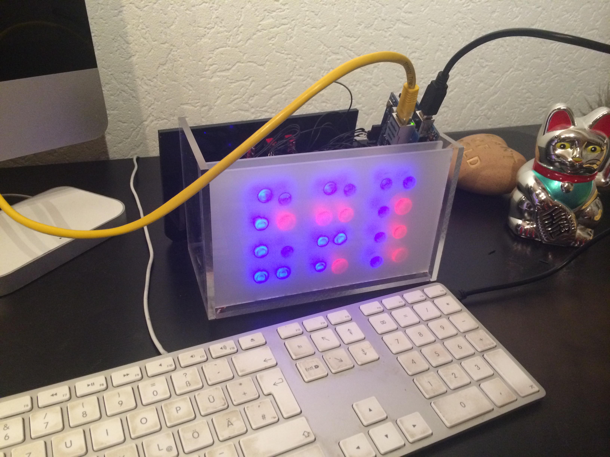

# ArduinoBinaryClock
Arduino based binary clock with Webinteface, GPS/NTP-Sync, Alarm, Timezones

# FEATURES
* Timesync via GPS or NTP-Server
* Timezone support
* Alarm
* Nightmode (dim leds)
* Colorcycle, custom colors set via webinterface

# PARTS
* Arduino Mega 2560 (the flash of the uno is to small)
* Wiz-Ethernetshield
* Serial GPS Module (optional)
* 24 WS2812 5mm LEDs
* MiniSpeaker for alarm
* 3 Switches
* acrylic glass for the case, but you can take any other material

# TOOLS
* soldering equipment
* dril 5mm, 6mm (for switches)
* saw
* hotglue

# SETUP HARDWARE

# SETUP SOFTWARE

# USE IT

