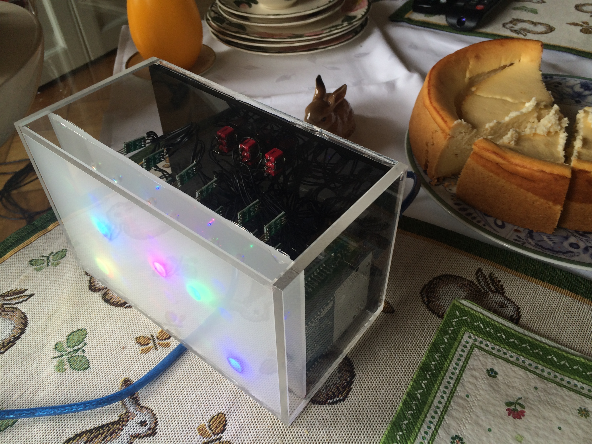

# ArduinoBinaryClock
Arduino based binary clock with Webinteface, GPS/NTP-Sync, Alarm, Timezones

# FEATURES
* Timesync via GPS or NTP-Server
* Timezone support
* Alarm
* Nightmode (dim leds)
* Colorcycle, custom colors set via webinterface

# PARTS
* Arduino Mega 2560 (the flash of the uno is to small)
* Wiz-Ethernetshield
* Serial GPS Module (optional)
* 24 WS2812 5mm LEDs
* MiniSpeaker for alarm
* 3 Switches
* acrylic glass for the case, but you can take any other material

# TOOLS
* soldering equipment
* dril 5mm, 6mm (for switches)
* saw
* hotglue

# SETUP HARDWARE (simplyfied version)

# SETUP SOFTWARE
* download the latest Arduino IDE
* download the sketch located at /src/arduino_binary_clock
* upload it to your arduino 

# USE IT
* connect the clock via ethernet with your local network
* connect usb to power the clock up
* get the ip from your clock via your router/dhcp server
* login to the webinterface with:

## Credentials
* USERNAME : admin
* PASSWORD : 1590

# IMAGES

